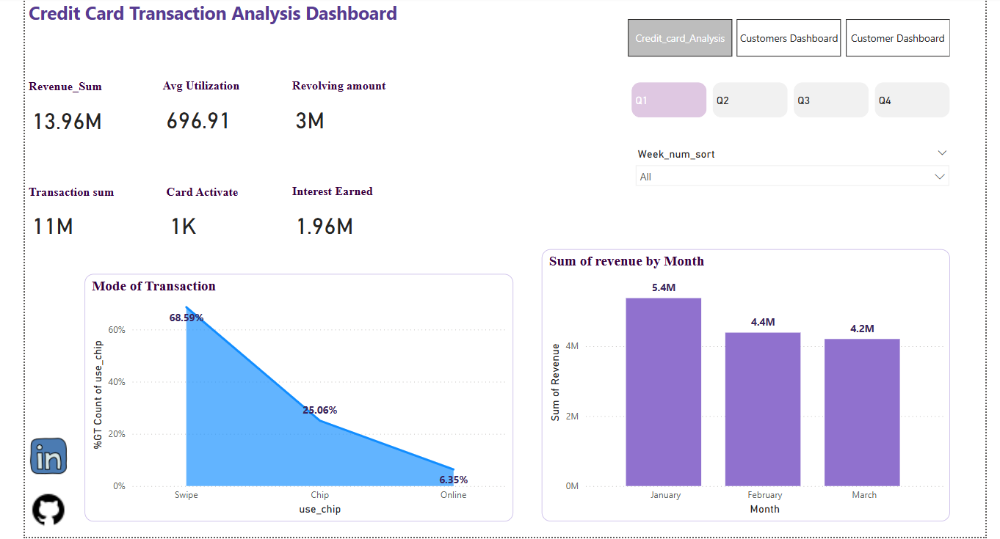

# Credit Card Transaction Analysis Dashboard

This project provides a **Credit Card Transaction Analysis Dashboard** that visualizes key metrics related to credit card usage, transaction trends, and revenue insights. The dashboard helps in understanding transaction behavior, revenue distribution, and usage patterns.

## Features
- **Revenue Analysis**: Displays total revenue, average utilization, and interest earned.
- **Transaction Insights**: Shows transaction volume, card activations, and revolving amounts.
- **Mode of Transaction**: Analyzes payment methods (Swipe, Chip, Online) with percentage distribution.
- **Monthly Revenue Trends**: Visualizes revenue changes across different months.
- **Quarterly Filtering**: Allows users to filter data based on quarters.

## Dashboard Screenshots

### Credit Card Analysis Dashboard

### Transaction Insights

### Revenue Trends

## How to Use
1. Open the dashboard in Power BI.
2. Use the filters to explore different quarters and weeks.
3. Analyze transaction trends, revenue, and usage patterns.
4. Gain insights into credit card utilization and revenue streams.

## Technologies Used
- **Power BI**: For data visualization.
- **Python & SQL**: Data preprocessing and transformation.
- **PostgreSql**: Data source.

Link of app
https://credit-card-revenue-prediction-app.streamlit.app/
